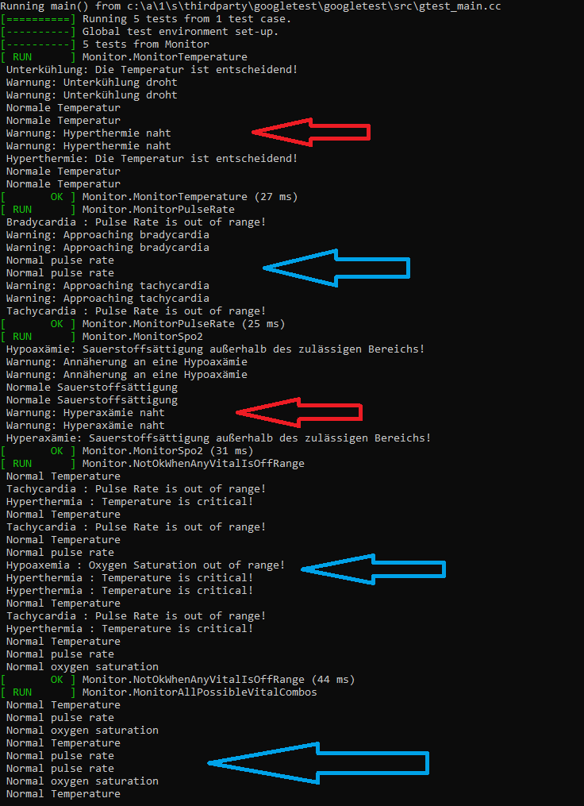

# Programming Paradigms

Health Monitoring Systems

[Here is an article that helps to understand the Adult Vital Signs](https://en.wikipedia.org/wiki/Vital_signs)

[Here is a reference to Medical monitoring](https://en.wikipedia.org/wiki/Monitoring_(medicine))

## Purpose

Continuous monitoring of vital signs, such as respiration and heartbeat, plays a crucial role in early detection and prediction of conditions that may affect the wellbeing of a patient. 

Monitoring requires accurate reading and thresholding of the vitals.

## Issues

- The code here has high complexity in a single function.
- The code is not modular 
- The tests are not complete - they do not cover all the needs of a consumer

## Tasks

1. Reduce the cyclomatic complexity.
1. Separate pure functions from I/O
1. Avoid duplication - functions that do nearly the same thing
1. Complete the tests - cover all conditions. 

## Self-evaluation

How well does our code hold-out in the rapidly evolving [WHDS](https://www.ncbi.nlm.nih.gov/pmc/articles/PMC6111409/)
Can we add future functionality without disturbing existing features? Can we do it with low effort and high reliability?

## The future

- New vital might need to be monitored (ex: SPO2 during pandemic)
- Vendor might provide additional vital reading (blood pressure)
- Limits may change based on age of patient

> Predicting the future requires Astrology!

## Keep it simple

Shorten the Semantic distance

- Procedural to express sequence
- Functional to express relation between input and output
- Object oriented to encapsulate state with actions
- Apect oriented to capture repeating aspects

# Extending and Refactoring

Following extensions have been supported:

Extension 1: Early Warning  
Extension 2: Support a language in addition to English - German support  
Extension 3: Accept input in different units  

# Screenshot

